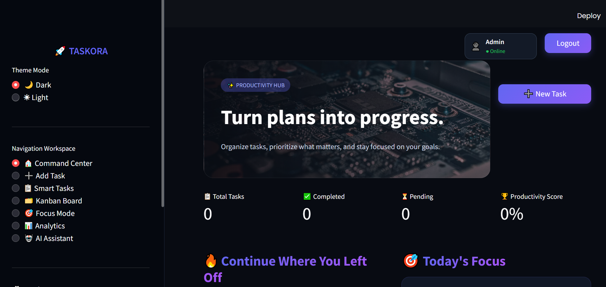
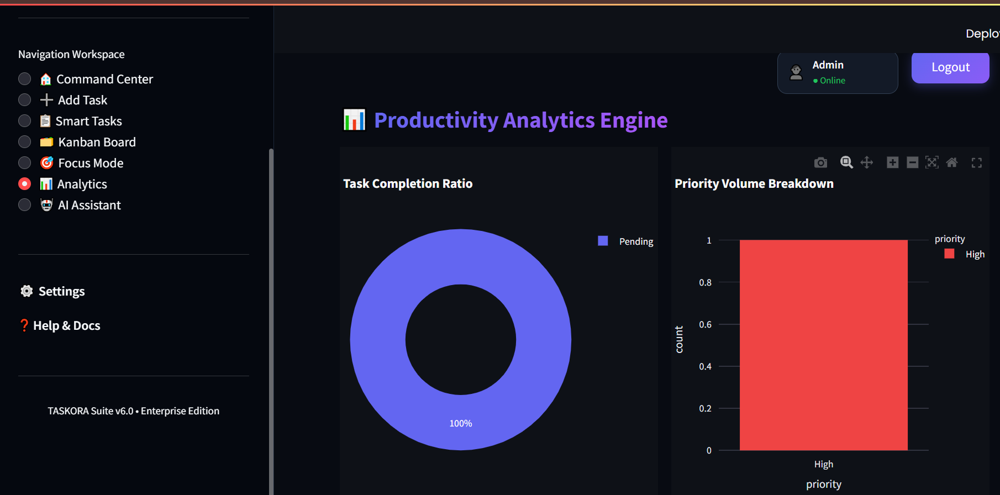
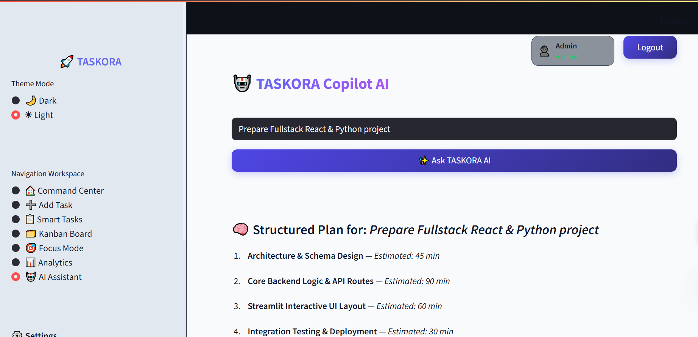

🚀 TASKORA — Smart Task Management & Productivity Suite

Turn plans into progress.

TASKORA is a modern productivity-focused Task Management System built with Python and Streamlit. It combines task organization, smart filtering, Kanban workflow, Focus Mode, analytics, theme customization, notifications, and an AI Assistant into one interactive productivity dashboard.

✨ Features

🏠 Command Center

Total, completed, and pending task metrics

Productivity score

Continue-where-you-left-off section

Quick actions

Modern productivity dashboard

📋 Smart Tasks

Search tasks by title

Filter by status and priority

Organize by category and tags

Track due dates and estimated time

Update and delete tasks

Export filtered data to CSV

➕ Add Task

Create structured tasks with:

Title

Priority

Due date

Category

Tags

Notes

Estimated time

🗂️ Kanban Board

Visualize work through a workflow such as:

To Do → In Progress → Completed

🎯 Focus Mode

A distraction-free workspace designed to help users concentrate on the task currently being completed.

📊 Analytics

Track productivity through:

Completion metrics

Pending work

Priority distribution

Productivity trends

Visual charts

🤖 AI Assistant

An AI-powered productivity module for task-related assistance, planning, prioritization, and productivity workflows.

🌙 Dark / ☀️ Light Theme

Switch between dark and light visual modes.

🔔 Notifications

Receive visual feedback and task-related system notifications.

📤 Data Export

Export filtered task information to CSV.

🖥️ Application Screenshots
## 🏠 Home Page

**Screenshot:** `home.png`

---

## 🧭 Command Center

**Screenshot:** `Command center.png`

---

## ➕ Add Task

**Screenshot:** `add task.png`

---

## 📋 Smart Tasks

**Screenshot:** `Smart task.png`

---

## 🗂️ Kanban Board

**Screenshot:** `Kanban board.png`

---

## 🎯 Focus Mode

**Screenshot:** `Focus Mode.png`

---

## 📊 Analytics

**Screenshot:** `Analytics.png`

---

## 🤖 AI Assistant

**Screenshot:** `AI Assistant.png`

---

## 🎨 Theme Customization

**Screenshot:** `Theme.png`

---

🧭 Command Center / Task Management

🛠️ Tech Stack

Technology

Purpose

🐍 Python

Application logic

🎈 Streamlit

Interactive web application

📊 Plotly / Charts

Analytics and visualization

🎨 HTML & CSS

Custom UI styling

🤖 AI Integration

Productivity assistance

📄 CSV

Data export

🔧 Git & GitHub

Version control

🏗️ Application Architecture

                    ┌───────────────────────┐
                    │       TASKORA         │
                    │   Streamlit Web App   │
                    └───────────┬───────────┘
                                │
             ┌──────────────────┼──────────────────┐
             │                  │                  │
             ▼                  ▼                  ▼
       Command Center      Smart Tasks        Analytics
             │                  │                  │
             │           ┌──────┼──────┐           │
             │           │      │      │           │
             ▼           ▼      ▼      ▼           ▼
        Dashboard      Search Filter Kanban     Charts
             │
       ┌─────┼─────────────┐
       │     │             │
       ▼     ▼             ▼
     Focus  AI Assistant  Notifications

📂 Project Structure

TASKORA/
│
├── app.py
├── task_manager.py
├── requirements.txt
├── README.md
├── .gitignore
│
├── screenshots/
│   ├── home.png
│   ├── add task.png
│   ├── AI Assistant.png
│   ├── Analytics.png
│   ├── Command center.png
│   ├── Focus Mode.png
│   ├── Kanban board.png
│   ├── Smart task.png
│   └── Theme.png
│
└── ...

🚀 Getting Started

1. Clone the repository

git clone <YOUR_GITHUB_REPOSITORY_URL>
cd TASKORA

Replace <YOUR_GITHUB_REPOSITORY_URL> with your actual repository URL.

2. Create a virtual environment

Windows

python -m venv venv
venv\Scripts\activate

macOS / Linux

python3 -m venv venv
source venv/bin/activate

3. Install dependencies

pip install -r requirements.txt

4. Run TASKORA

streamlit run app.py

Then open the local Streamlit URL, usually:

http://localhost:8501

⚙️ Configuration

If the AI Assistant uses an external API, keep credentials outside the source code.

For Streamlit secrets, use:

.streamlit/
└── secrets.toml

Never commit API keys or passwords to GitHub.

Recommended .gitignore entries:

.env
.streamlit/secrets.toml
venv/
__pycache__/
*.pyc

📊 Typical Workflow

Create Task
     ↓
Set Priority & Deadline
     ↓
Organize in Smart Tasks
     ↓
Move through Kanban
     ↓
Use Focus Mode
     ↓
Complete Task
     ↓
Review Analytics
     ↓
Use AI Assistant for Planning

💡 Design Philosophy

🎯 Productivity First

Every major feature is designed to help users understand, prioritize, or complete their work.

🧠 Reduce Cognitive Load

Search, filters, task metadata, Kanban views, and analytics make large task lists easier to manage.

🎨 Modern SaaS Experience

TASKORA uses custom styling, visual hierarchy, a focused navigation system, and a productivity-oriented interface.

📈 Data-Driven Productivity

Task information is transformed into useful metrics and productivity insights.

🧩 Modular Growth

The application is designed to evolve with additional modules such as persistent storage, authentication, AI automation, and advanced analytics.

🔮 Roadmap

SQLite/PostgreSQL persistent database

User authentication and multiple accounts

Task subtasks and nested checklists

Drag-and-drop Kanban

Recurring tasks

Calendar integration

Email/browser reminders

Advanced productivity analytics

AI-powered task prioritization

AI-generated daily schedules

AI task breakdown

PDF/Excel export

Activity history

Automated testing

Docker support

Cloud deployment

🧪 Testing

When tests are available:

pytest

For a basic Python syntax check:

python -m py_compile app.py

🔐 Security

For production deployment:

Never hard-code API keys.

Never commit .env or secrets files.

Validate user input.

Use authentication before exposing private task data.

Use persistent database storage for production workloads.

Use the deployment platform's secret-management system.

🚀 Deployment

Typical deployment flow:

GitHub Repository
       ↓
Streamlit Deployment
       ↓
TASKORA Web Application

Before deployment:

Ensure requirements.txt is present.

Commit all required application files.

Configure secrets securely.

Remove local-only paths.

Verify the app starts with streamlit run app.py.

📈 What This Project Demonstrates

TASKORA demonstrates practical experience with:

Python application development

Streamlit web development

CRUD-style task management

UI/UX design

Custom HTML/CSS styling

Application state management

Search, filtering, and sorting

Data visualization

Productivity analytics

CSV export

AI-assisted application design

Git/GitHub workflow

Modular application design

Deployment readiness

👩‍💻 Author

Prabhanshi Yadav

B.Tech — Computer Science & Engineering
Machine Learning & Artificial Intelligence

